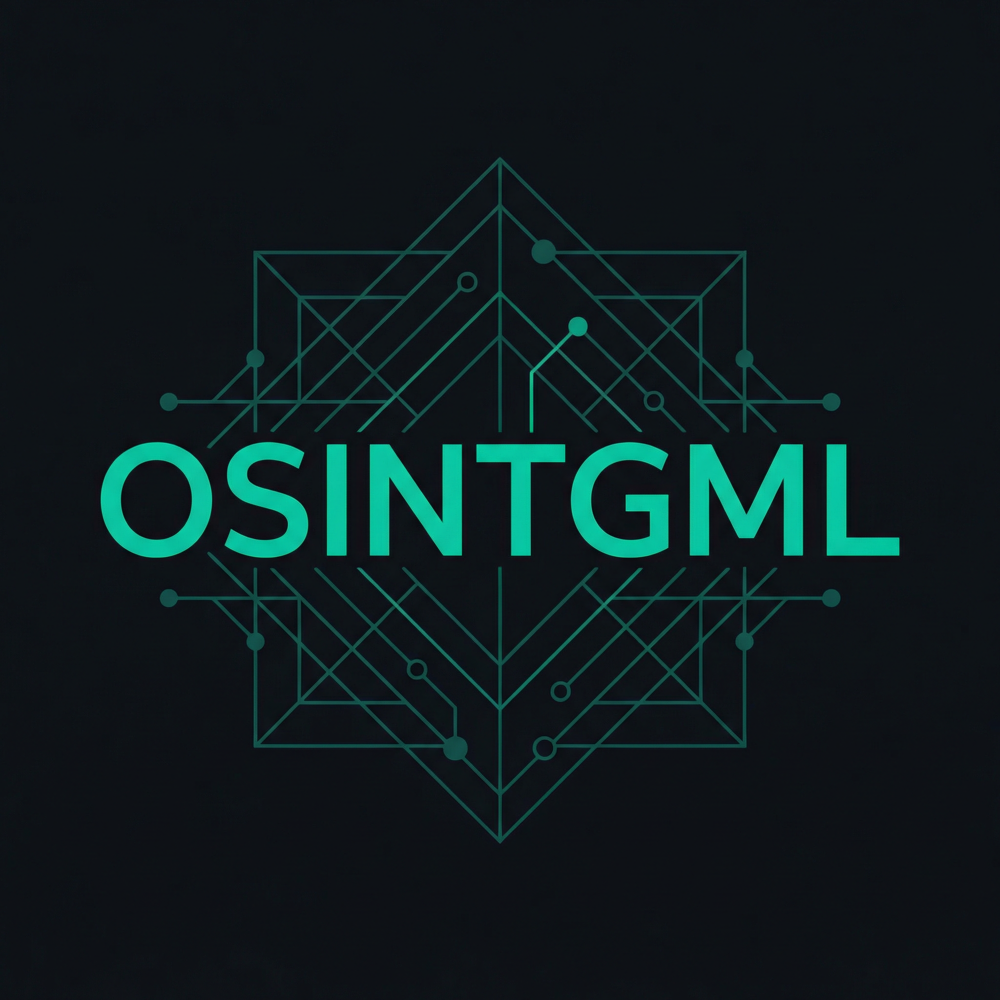

# OSINTGML

<p align="center">
  
</p>

Account recovery + email variations — CLI tools.

## Demo


- **Account recovery**: username/email → masked contact info (forgot password flows).
- **Email variations**: masked email + optional first/last name, numbers, username → candidate emails.

## Run

```bash
pip install -r requirements.txt
python main.py
```

Set `GEMINI_API_KEY` in `.env` (or export) for email variations.
